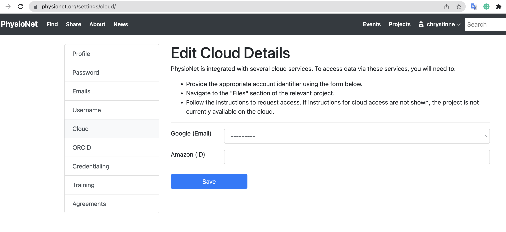
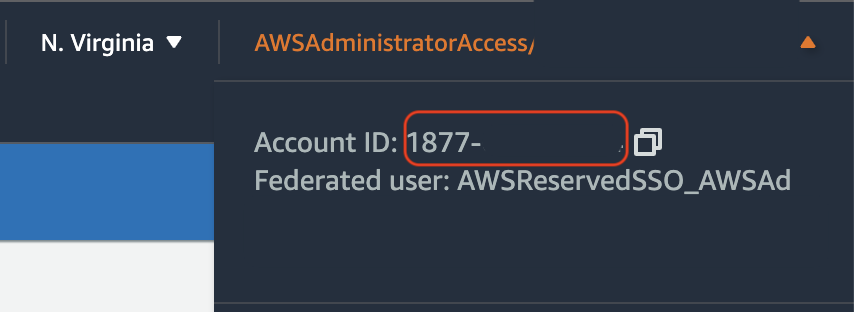
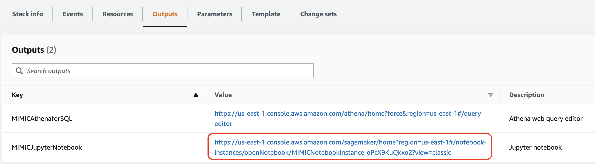
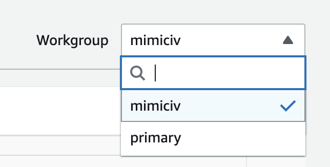

## Cloud access to datasets

The MIMIC-IV database is available on Amazon Web Services (AWS). To access the data on the cloud, simply add the your 12-digit AWS account ID to your PhysioNet profile as follows (https://physionet.org/settings/cloud/):

You can get your 12-digit account ID from the AWS console. In the navigation bar select the dropdown from the top right corner. Your currently signed-in 12-digit account number (ID) appears in the dropdown:

### Launch MIMIC-IV in AWS

MIMIC-IV (version 2.0) is available in an Amazon S3 bucket hosted on AWS. You can use an interactive query service like [Amazon Athena](https://aws.amazon.com/athena/?whats-new-cards.sort-by=item.additionalFields.postDateTime&whats-new-cards.sort-order=desc) to run standard SQL queries against the dataset, or programmatically in an [Amazon Sagemaker notebook instance](https://docs.aws.amazon.com/sagemaker/latest/dg/nbi.html) with the latest Jupyter Notebook App pre-installed.

To get started, deploy this [cloudformation template](https://console.aws.amazon.com/cloudformation/home?region=us-east-1#/stacks/new?stackName=MIMICIV&templateURL=https://template-mimiciv.s3.amazonaws.com/template.yaml). Deploying this template will create the following in your AWS account:

* An AWS Glue database called `mimiciv`
* AWS Glue tables (metadata) which define the schema for each table in the `mimiciv` database
* **Optional**: An Amazon Sagemaker notebook instance with an example python notebook demonstrating access to `mimiciv`. This will be deployed by default, but you can optionally specify `No` when deploying the template. **Specifying `No` is useful if you do not have permissions to create an IAM role in your AWS account**.
* An Amazon Athena workgroup configured to allow SQL queries against the `mimiciv` database
* An Amazon S3 bucket for use with the Amazon Athena workgroup to store query results

To start this deployment, click the Launch Stack button. Once the Stack has complete deploying, look at the **Outputs** tab of the AWS CloudFormation console for relevant links to your environment.

### Sagemaker Notebook Instance

You can access your notebook instance by clicking the URL in the `Outputs` tab in the CloudFormation console:

There is an example notebook called `mimiciv-notebook` already installed on the instance to get you started.

### Amazon Athena Query Editor

The `Outputs` tab also has a link to the Amazon Athena query editor interface. Here you can author SQL queries and run them against the `mimiciv` database.

Once in the web interface, you'll need to switch to the `mimiciv` workgroup, located towards the top right of the screen:

This workgroup is configured to log results to an S3 bucket that has been created for you.

## Clean Up

When you're done, be sure to delete all the resources in your AWS account. You can do this by simply deleting the CloudFormation stack you deployed earlier.

From the CloudFormation console, select the `MIMICIV` stack and click the **Delete** button. This will delete all resources created by this template and you will no longer accrue charges.
